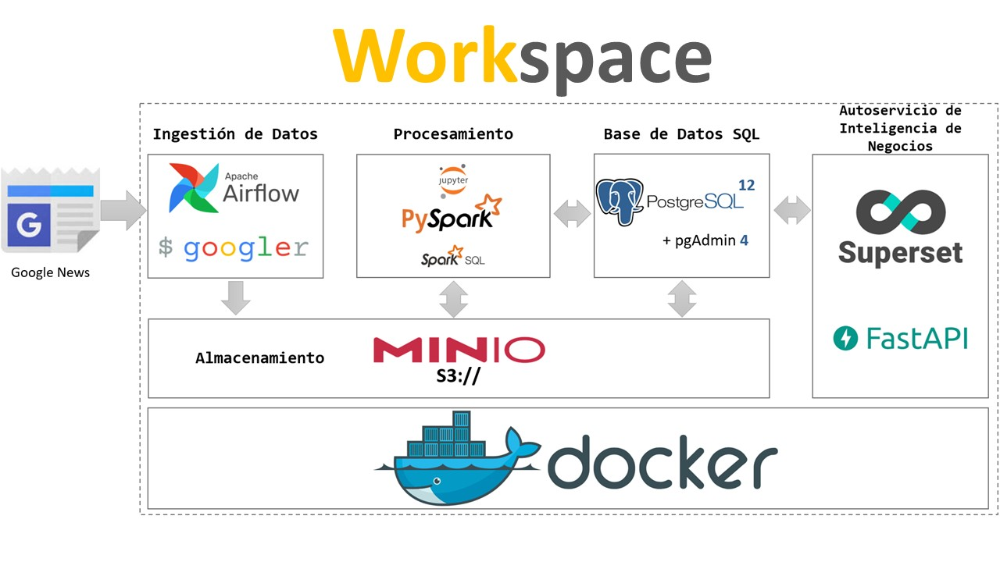

# Proyecto Web Scrapaing en Workspaces End2End


## Analizando Big Data de Noticias con Workspace (Baterías Incluidas)
En este proyecto mostraré como ejecutar en tu equipo personal o en un workspace los componentes básicos de una plataforma de datos, con esfuerzo mínimo gracias a la tecnología de workspaces. Por cierto, si aun no cuentas con las herramientas para el desarrollo de este proyecto, este es un buen momento para que lo hagas adquiriendo tu Workspace. 

Gracias a esta tecnología bastará con ejecutar una sola línea en tu terminal y despues de un par de minutos tendrás todos los componentes básicos de una plataforma de datos ejecutándose en tu navegador. Con todo esto en ejecución podrás realizar facilmente este proyecto en el cual recolectarás sistemáticamente miles de artículos de noticias de los últimos meses, creando una base de datos semiestructurada. 

Todas las noticias recolectadas serán almacenadas en un deposito de objetos basados en la tecnología S3 de Amazon, pero corriendo "localmente" en tu propio workspace con tecnologías Open Source. Después de esto realizaremos un análisis de Big Data - recolectado mediante PySpark - y haciendo uso de los Notebook Jupyter, con lo que realizaremos algunos resúmenes y le daremos estructura a los datos para ser puestos en la base de datos relacional PostgreSql.

Por último, conectaremos una herramienta de Inteligencia de Negocios de última generación para analizar y visualizar los datos procesados.

## Requerimientos y Arquitectura del Proyecto



---------------

``` Uno de los proyectos de más relevancia en la industrialización de los datos en los últimos años es el concepto de plataforma de datos - que no es más que la combinación de diferentes aplicaciones y herramientas que al combinarlas permite generar cargas de datos de un extremo a otro - esto ha permitido en las empresas salir del conocido sistema monolítico de las bases de datos tradicionales a los nuevos sistemas de cargas de trabajo soportadas en datos. ```

-----------------------

Para nuestro caso de uso se diseño una plataforma de datos sencilla, pero algunos elmentos muy poderosos - con el objetivo de simular cargas de trabajo de un extremo a otro - y como primer caso de uso - usaremos Web-Scraping - donde ejecutaremos cargas de datos haciendo uso de las siguientes tecnologías:

- Airflow: Apache Airflow es un motor de flujo de trabajo donde se programa y ejecuta fácilmente canalizaciones de datos complejas. Se asegurará de que cada tarea de canalización de datos se ejecute en el orden correcto y que cada tarea obtenga los recursos necesarios.

- Spark: Es un framework de procesamiento de datos que puede realizar rápidamente tareas de procesamiento en conjuntos de datos muy grandes y también puede distribuir tareas de procesamiento de datos en varias computadoras distribuidas

- Postgres: Es una base de datos relacional altamente conocida y usada por muchas empresas en la cual se pueden crear desde, bases de datos básicas, hasta bases de datos altamente complejas y escalables a través de tecnologías como kuberntes.

- Minio: De manera simplificada "Es como Amazon S3, pero alojado localmente". Es como tu propio lago de datos en tu infraestructura o PC. Minio es un servidor de almacenamiento de objetos que implementa la misma API pública que Amazon S3. Esto significa que las aplicaciones que pueden configurarse para comunicarse con Amazon S3 también pueden configurarse para comunicarse con Minio. 

- Superset: Es una herramienta de Business Intelligence fácil de usar que recopila y procesa datos en grandes volúmenes para producir resultados visualizados como tablas y gráficos. Es completamente web por lo tanto, la aplicación web permite a los usuarios generar cuadros de mando e informes que ayudan con los procesos de analítica.

- Jupyter Notebooks: Es una aplicación web de código abierto que puede usar para crear y compartir documentos que contienen código en vivo, ecuaciones, visualizaciones y texto. Su uso más común es en las ciencias de datos pero se ha extendido a campos como la ingeniria de datos.

--------------------------

_Para desarrollar este curso es necesario contar con estos elementos instalados en sus PC - sino cuentas con estas herramientas puedes desarrllarlo en z2h adquiriendo un workspace

-----------------------------------

## Resumen y Pasos a seguir: 
----------------------
1. A través de Airflow crearemos un DAG el cual se encargará de ejecutar en la implementación concreta de nuestro Lago de Datos(minio), la ultma versión extendida de la herramienta llamada Googler (https://github.com/jarun/googler) la cual ofrece la característica de poder consultar en Google y varios de sus servicios como lo son Búsquedas Web, Noticias y Videos desde la consola del sistema operativo, es decir sin usar explícitamente un navegador web. Es decir, combinando Airflow y Googler, automatizamos la consulta y almacenamiento de búsquedas en Google. El autor de este artículo modificó Googler para que también descargue todo el contenido de las noticias, no solamente el resumen. Por lo que la ingestión será mucho mayor y se tendrá más texto para analizar.

2. Posteriormente será necesario aplicar técnicas de Ciencia de Datos para generar valor a partir de los datos recolectados en el sistema de almacenamiento de nuestro Lago de Datos. Derivando al siguiente componente al que se denomina Procesamiento. Aquí usamos la tecnología Apache Spark (https://spark.apache.org/) en su variante de Python (PySpark) complementada con SparkSQL, para simplificar el procesamiento de la información semiestructurada recolectada en formato JSON. Es en este componente que ocurre la mayor parte del procesamiento Big Data, así como la aplicación de técnicas de Machine Learning con la finalidad de extraer valor de los datos recolectados. En este componente se generan resúmenes y se le dotará de estructura a los datos, con lo que pueden ser colocados en almacenamientos estructurados mas tradicionales, como puede ser una Base de Datos SQL el cual es el siguiente componente de nuestro Lago de Datos.

3. Es a nuestra Base de Datos SQL(Postgres) que se transfieren los resultados de los diferentes análisis que se realicen, elegimos PostgreSQL como la base de datos debido a su robustez y los avances en eficiencia de la versión 12. Es a este motor de Datos que se conectan los componentes de Entrega de Datos y Autoservicio de Inteligencia de Negocios que son los últimos componentes de nuestra interpretación de un Lago de Datos.

4. El Autoservicio de Inteligencia de Negocios es una de las salidas que permite la exploración de los resultados producto del análisis de Big Data, así como la generación Tableros de Control y Visualizaciones atractivas que soporten la toma de decisiones para el resto de la organización. Aquí elegimos la tecnología Apache Superset (https://superset.apache.org/) que permite realizar exploración de datos interactiva y visualmente atractiva.

-------------------

_Por último nuestro Lago de Datos no incorpora los componentes de Gobernanza, Seguridad de Datos y Administración de Metadatos. Dichos componentes dependen de las reglas y tecnologías adoptadas por cada organización, por lo que en esta versión las dejamos fuera. Sin embargo son parte de la definición completa de un Lago de Datos. Esto lo veremos en la siguiente versión de los entornos de desarrollo  de https://xploiter.co donde implementaré los muy conocidos delta lakes  https://delta.io/ el cual cubre los nuevos conceptos de lago de datos conocidos como Lakehouses_

--------------------

## Desarrollo

Crearemos tres carpetas principales: "config", "notebooks" y "services" - sobre las cuales se crearán otros sub-directorios - en estas tres carpetas almacenaremos algunos de los archivos que usaremos como el DAG que se implementará en airflow o las variables de entorno - Estas carpetas servirán como directorios de ruta para los contenedores. La estructura del directorio quedarán así (preview): 

```
├── config
├── notebooks
│   ├── libs
│   ├── news
├── services
│   ├── airflow
│   ├── fastapi
│   ├── jupyter-spark
│   ├── postgresql
│   ├── postgresql
├── docker-compose.yml
├── Readme.md
├── LICENSE 
```


